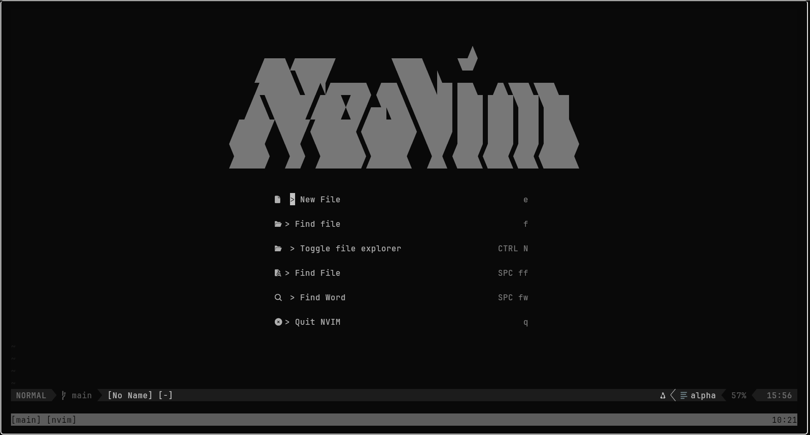
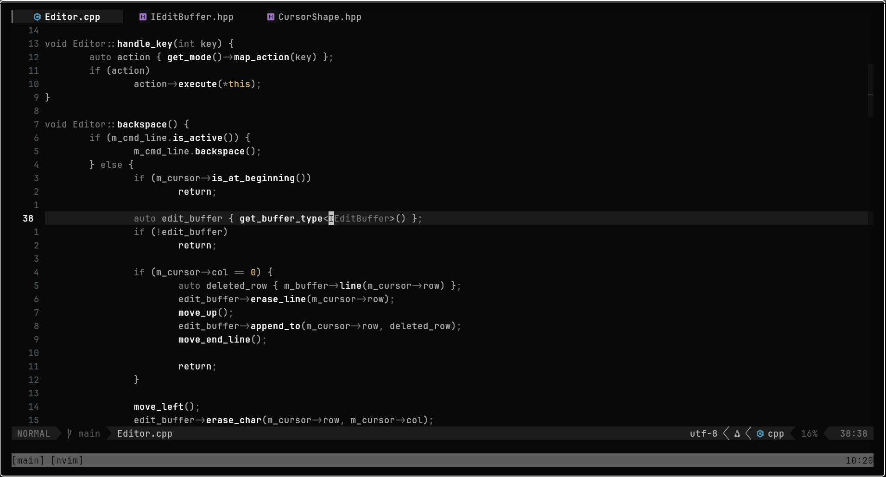
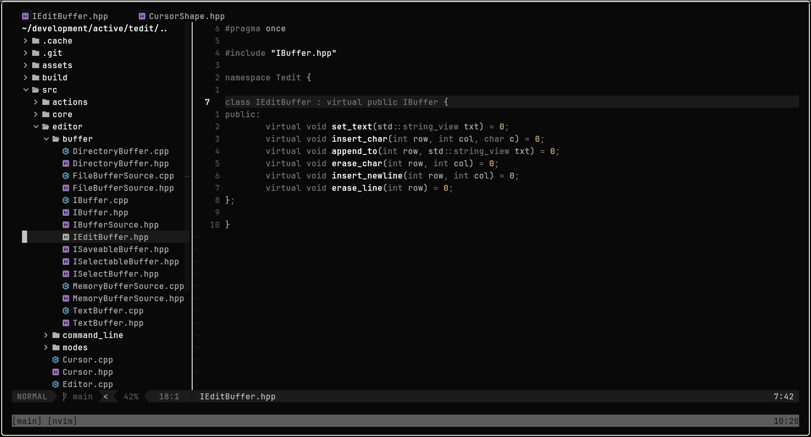
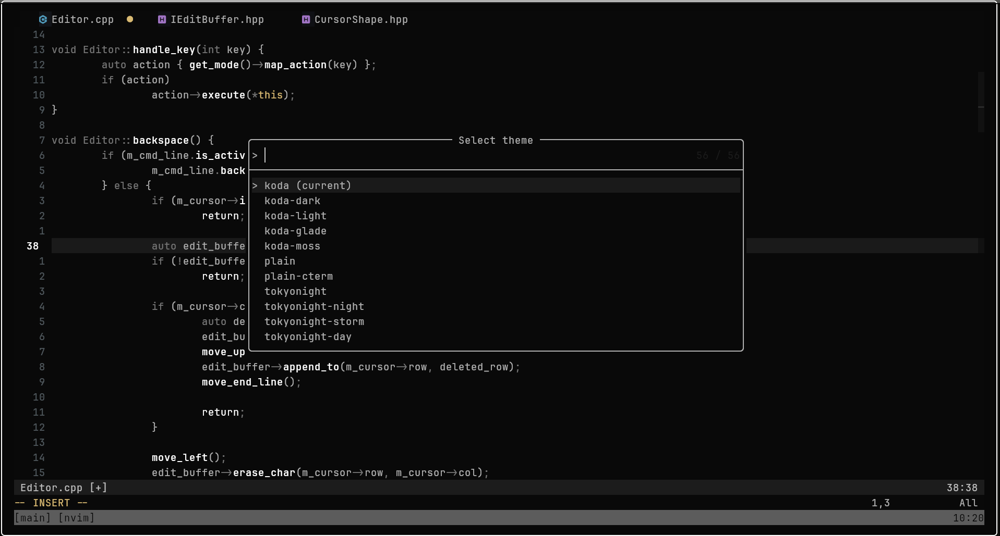

# Salar's Neovim Config

A focused Neovim setup for day-to-day coding, with fast navigation, LSP-backed editing, debugging, file browsing, and a theme workflow that is easy to switch without touching config files.

## Showcase

| Start screen | Code editing |
| --- | --- |
|  |  |

| File tree | Theme picker |
| --- | --- |
|  |  |

## Highlights

- Plugin management through [lazy.nvim](https://github.com/folke/lazy.nvim), bootstrapped automatically on first launch.
- Fuzzy finding, live grep, references, implementations, and diagnostics through Telescope.
- LSP setup for TypeScript, C/C++, Lua, Rust, Typst, Haskell, GDScript, and Godot shader files.
- Completion with `nvim-cmp`, LuaSnip snippets, path suggestions, buffer words, and LSP sources.
- Treesitter highlighting for common web, systems, scripting, markdown, Haskell, and Godot filetypes.
- C/C++/Rust debugging through `nvim-dap`, with LLDB or CodeLLDB auto-detection.
- A custom theme picker with persisted selection and quick next/previous theme commands.
- Practical UI touches: file tree, bufferline, lualine, diagnostics, folds, markdown rendering, and quality-of-life editing plugins.

## Install

Back up your existing config first, then clone this repo into Neovim's config directory:

```sh
git clone https://github.com/SalarAlo/neovim_configuration ~/.config/nvim
nvim
```

On first launch, `lazy.nvim` installs itself and then installs the configured plugins.

### External tools

Some features work best when these tools are available on your `PATH`:

- `git`, `make`, and a C compiler for native plugin builds.
- Language servers such as `clangd`, `rust-analyzer`, `lua-language-server`, `tinymist`, and `haskell-language-server-wrapper`.
- `lldb-dap` or `codelldb` for debugging C, C++, and Rust.
- `gdshader-lsp` for Godot shader support.

## Keybindings

Leader is `<Space>`.

| Key | Action |
| --- | --- |
| `<leader>ff` | Find files |
| `<leader>fw` | Live grep |
| `<leader>fc` | Search word under cursor |
| `<C-n>` | Toggle file tree |
| `<leader>e` | Focus file tree |
| `<Tab>` / `<S-Tab>` | Next / previous buffer |
| `<leader>x` | Close current buffer |
| `<leader>ts` | Select theme |
| `<leader>tn` / `<leader>tp` | Next / previous theme |
| `gd`, `gD`, `gi`, `gt` | LSP navigation |
| `<leader>ca` | Code action |
| `<leader>rn` | Rename symbol |
| `<leader>d` / `<leader>D` | Line / buffer diagnostics |
| `<leader>dc` | Continue debugger |
| `<leader>db` | Toggle breakpoint |
| `<leader>ds`, `<leader>di`, `<leader>do` | Step over / into / out |

## Structure

```text
init.lua                 Entry point
lua/salar/core/          Options, keymaps, theme state, filetype setup
lua/salar/plugins/       Plugin specs
lua/salar/plugins/lsp/   LSP and Mason setup
lua/salar/tools/         Small local helper tools
showcase/                README screenshots
```
